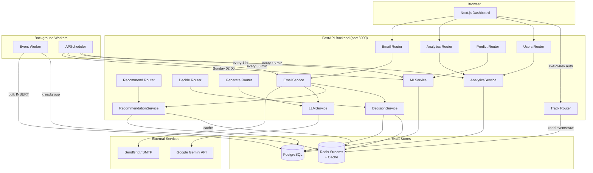

# 2. System Architecture

## Component Overview

SmartMail AI+ is a **monorepo** containing five distinct runtime layers plus two background subsystems.

| Component | Technology | Responsibility |
|-----------|-----------|----------------|
| **Next.js Frontend** | Next.js 14, React 18, TypeScript, Tailwind | Analytics dashboard UI; server-side data fetching |
| **FastAPI Backend** | Python 3.12, FastAPI 0.115, Uvicorn | REST API, business logic orchestration |
| **PostgreSQL** | PostgreSQL 16 (asyncpg) | Primary data store for all entities |
| **Redis** | Redis 7 | Event stream (`events:raw`), recommendation cache, ML model pointer, email cooldowns |
| **Event Worker** | asyncio background task | Consumes Redis Stream → bulk-inserts to PostgreSQL |
| **APScheduler** | APScheduler 3.10 | Periodic analytics refresh, ML inference, weekly retraining, campaign triggers |
| **ML Pipeline** | scikit-learn, joblib | Offline training of churn + intent classifiers |
| **Gemini API** | Google Gemini (`gemini-2.0-flash`) | LLM email copywriting |
| **Email Provider** | SendGrid / SMTP (aiosmtplib) | Transactional email dispatch |
| **MailHog** (dev) | MailHog | Local SMTP sink for development |

---

## Architecture Diagram



---

## Component Details

### FastAPI Backend (`backend/app/`)

- **Entry point** — `main.py` wires routers, starts the event worker as an `asyncio.Task`, and starts APScheduler via the `lifespan` context manager.
- **Routers** (`routers/`) — thin HTTP layer: validate input, call a service, return a response. No business logic.
- **Services** (`services/`) — all business logic lives here; one service per domain:
  - `AnalyticsService` — builds user profiles, computes engagement scores, returns KPI summaries.
  - `MLService` — loads versioned `.pkl` models, builds feature vectors, runs inference.
  - `RecommendationService` — collaborative filtering (SVD) with popularity cold-start fallback.
  - `DecisionService` — rule-priority decision tree using thresholds from `config.py`.
  - `LLMService` — constructs prompts from `.txt` templates, calls Gemini, parses JSON response.
  - `EmailService` — injects tracking tokens, dispatches via SendGrid or SMTP, orchestrates the full pipeline.
- **Workers** (`workers/`) — `event_worker.py` subscribes to Redis Streams consumer group `event_workers`; `scheduler.py` runs four APScheduler jobs.
- **Configuration** — all settings via `pydantic-settings` from `.env`; never hardcoded.

### PostgreSQL Database

- All tables use **UUID primary keys** (`gen_random_uuid()`).
- ORM via **SQLAlchemy 2.0** async mapped columns.
- Migrations managed by **Alembic** (`alembic upgrade head`).
- See [5-database.md](./5-database.md) for full schema.

### Redis

| Key Pattern | Purpose | TTL |
|-------------|---------|-----|
| `events:raw` (Stream) | Raw event ingestion queue | — |
| `events:failed` (Stream) | Dead-letter queue for failed events | — |
| `recommend:{user_id}:{n}` | Cached product recommendation IDs | 1 hour |
| `cooldown:{user_id}` | Email send cooldown flag | `EMAIL_COOLDOWN_HOURS` |
| `ml:active_model:{name}` | Active model version pointer | — |

### ML Pipeline (`backend/ml/`)

- **Feature pipeline** (`feature_pipeline.py`) — queries `user_profiles` + `events`, computes rolling 7/30-day stats, assigns churn and intent labels, outputs CSV.
- **Training** (`train_churn.py`, `train_intent.py`) — stratified 80/20 split, saves `{name}_v{n}.pkl` via `joblib`.
- **Inference** — `MLService.get_model()` checks `ml:active_model:{name}` in Redis; falls back to latest `.pkl` on disk. Models cached in module-level dict — only reloaded when the version pointer changes.

### Next.js Frontend (`frontend/`)

- Uses **App Router** for server-side rendering where possible (`export const revalidate = 60`).
- `lib/api.ts` — centralised typed API client; injects `X-API-Key` header on every request.
- Pages fetch data directly in Server Components; client components used only for interactive widgets (charts, buttons).

---

## Data Flow Summary

```
Storefront SDK          Redis Streams       PostgreSQL
──────────────          ─────────────       ──────────
POST /api/track   →     events:raw    →     events table
                         Event Worker
                             ↓
                        Analytics refresh (every 15 min)
                             ↓
                        user_profiles table
                             ↓
                        ML inference (every 1 hr)
                             ↓
                    churn_risk + purchase_probability
                             ↓
                    Campaign trigger (every 30 min)
                             ↓
                    Decision → Recommend → Generate → Send
                             ↓
                    email_logs table + email_open/click events
```

---

## Scalability Considerations

- **Event worker** uses Redis Streams consumer groups — multiple worker replicas can be added without changing code.
- **Recommendation service** caches results in Redis (TTL 1h); CF computation is skipped on cache hit.
- **APScheduler** processes users sequentially in v1; a future version can fan out via Celery or RQ.
- **Database** queries use parameterised statements throughout; indexes on `(user_id, timestamp DESC)` and `(event_type, timestamp DESC)` for the events hot path.
- **Frontend** uses `revalidate = 60` ISR (Incremental Static Regeneration) to reduce backend load.
- The entire stack is containerised — horizontal scaling of the backend is a single `docker compose scale backend=N`.

---

## Security

- All API endpoints require `X-API-Key` header validated by `verify_api_key` dependency.
- Rate limiting enforced via `check_rate_limit` dependency on every router.
- PII (email addresses, names) is never logged at INFO level or above.
- Tracking tokens are stripped from logs.
- CORS is restricted to `settings.FRONTEND_URL`.
