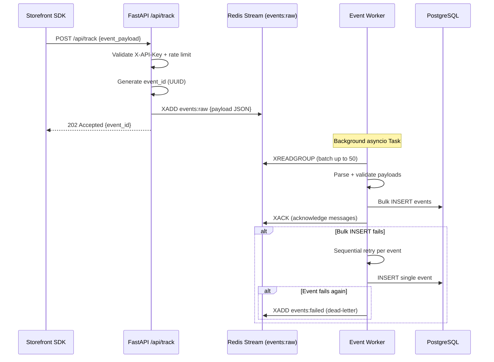
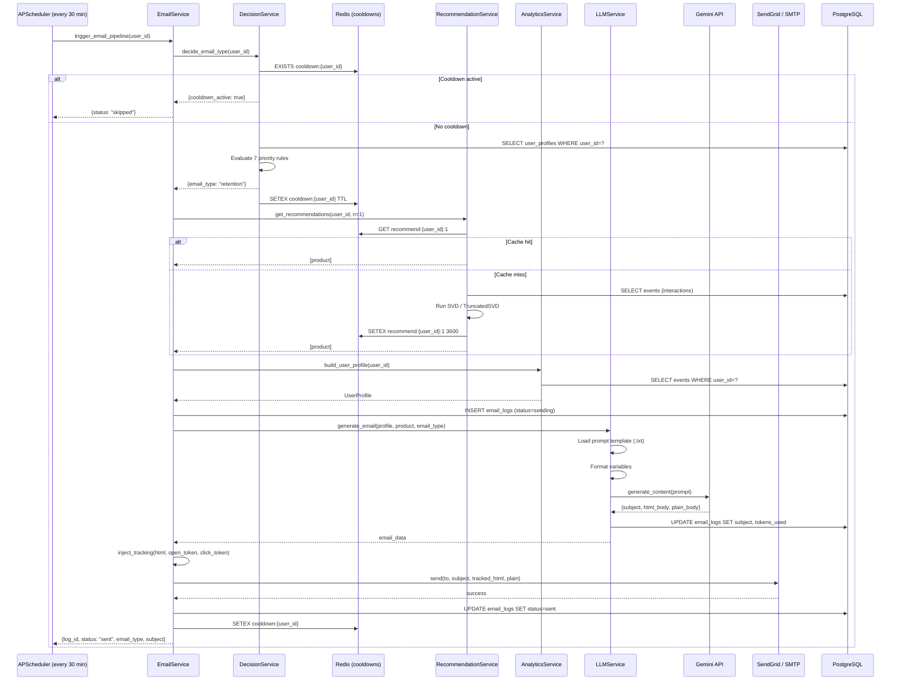
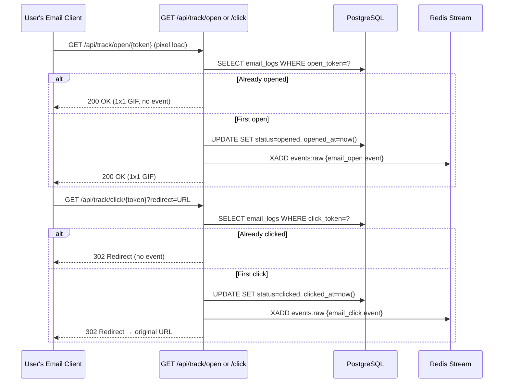

# 6. System Workflows

## 6.1 Event Ingestion Flow

How a single user action travels from the browser to persistent storage.



**Key behaviours:**
- The HTTP response is returned immediately after the Redis `XADD` — the caller is never blocked by database I/O.
- The worker uses a **consumer group** (`event_workers`) so multiple worker replicas can share the load.
- Failed events land in `events:failed` stream for manual inspection or replay.

---

## 6.2 Full Email Pipeline Flow

The complete journey from a campaign trigger to email delivery and attribution tracking.



---

## 6.3 Email Open / Click Tracking Flow

How engagement events are captured and fed back into the system.



---

## 6.4 Analytics Refresh Flow

How user profiles are continuously rebuilt from raw events.

```
APScheduler (every 15 min)
    ↓
refresh_analytics_job()
    ↓
For each user_id in users table:
    AnalyticsService.build_user_profile(session, user_id)
        ↓
        SELECT * FROM events WHERE user_id = ? ORDER BY timestamp DESC
        ↓
        Compute:
          - total_events, total_purchases, total_spend
          - last_active_at, days_since_last_purchase
          - preferred_categories (Counter over event categories)
          - top_viewed_products (Counter over product_view events)
          - engagement_score (recency + frequency + monetary formula)
          - RFM scores
        ↓
        UPSERT INTO user_profiles
    ↓
    COMMIT (per user, to release locks early)
```

---

## 6.5 ML Prediction Refresh Flow

How churn risk and purchase probability are kept current.

```
APScheduler (every 1 hour)
    ↓
ml_prediction_refresh_job()
    ↓
For each user_id in users table:
    MLService.run_full_prediction(session, user_id)
        ↓
        1. AnalyticsService.build_user_profile() → UserProfile
        2. AnalyticsService.get_rolling_event_counts() → {7d, 30d counts}
        3. Construct 12-feature vector
        4. MLService.predict_churn(features)
              ↓ MLService.get_model("churn")
                    → Check Redis ml:active_model:churn
                    → Load churn_v{N}.pkl if version changed
              ↓ model.predict_proba() → churn_risk float
        5. MLService.predict_purchase_intent(features)
              → intent_v{N}.pkl → purchase_probability float
        6. UPDATE user_profiles SET churn_risk, purchase_probability
    ↓
    COMMIT
```

---

## 6.6 Weekly ML Retraining Flow

```
APScheduler (Sunday 02:00 UTC)
    ↓
weekly_retrain_job()
    ↓
Phase 1 — Feature Engineering:
    feature_pipeline.get_features_df(session)
        ↓
        Rebuild all user_profiles
        ↓
        Compute rolling stats per user
        ↓
        Assign labels:
          churned = 1 if days_since_last_active > 60
          converted = 1 if purchase within 7 days of product_view
        ↓
        Save → churn_features.csv, intent_features.csv
    ↓
Phase 2 — Training:
    train_churn():
        Load churn_features.csv
        Stratified 80/20 split
        RandomForestClassifier(n_estimators=100, max_depth=10).fit()
        Evaluate: accuracy, F1, AUC on test set
        joblib.dump(model, ml/models/churn_v{N}.pkl)
        Log metrics → model_logs table
        UPDATE Redis ml:active_model:churn → v{N}
    ↓
    train_intent():
        (Same flow with LogisticRegression and intent_features.csv)
```

---

## 6.7 User Journey — Dashboard Operator

How a marketing analyst uses the dashboard to understand and act on customer data.

```
1. Open dashboard (/) 
   → KPI cards: total users, avg engagement, emails sent, conversion rate
   → Area chart: daily event volume (last 30 days)

2. Navigate to /users
   → Paginated table: email, name, engagement score, churn risk, purchase probability
   → Search by name or email
   → Click a user row → /users/[id]

3. User detail page (/users/[id])
   → Full profile: RFM scores, preferred categories, top products
   → Engagement badge (green/yellow/red)
   → Churn risk bar
   → Top product recommendations
   → "Send Email" button → POST /api/send-email/{id}
      → Real-time response: email type sent, subject, tokens used

4. Navigate to /campaigns
   → Email log table: type, subject, status, open/click timestamps
   → Verify delivery, open, and click attribution

5. Navigate to /analytics
   → Event trend charts filtered by type and time range
```

---

## 6.8 Recommendation System — Detailed Logic

```
get_recommendations(user_id, n=3)
    ↓
Step 1: Check Redis cache (recommend:{user_id}:{n})
        → Cache HIT: fetch products by ID, return immediately
    ↓
Step 2: Fetch UserProfile → total_events
        Fetch exclude_ids (already purchased or carted products)
    ↓
Step 3: Cold-start check (total_events < 5)
        → get_cold_start_ids():
            (a) Top products in user's preferred_categories[0] by event count
            (b) Fallback: overall most-popular active products
    ↓
Step 4 (warm users): Collaborative Filtering
        Build interaction matrix:
            purchase events → score 5.0
            cart_add events → score 3.0
            product_view events → score 1.0
        Aggregate per (user, product) pair
    ↓
        If scikit-surprise available:
            SVD.fit(full trainset)
            predict scores for all candidate products
        Else (sklearn fallback):
            TruncatedSVD(n_components=min(10, ...))
            Reconstruct ratings matrix
            Extract user row → rank candidates
    ↓
Step 5: Fill shortfall with cold-start if SVD returns < n results
    ↓
Step 6: Fetch Product objects from PostgreSQL
        Cache in Redis (TTL 3600s)
        Return ordered list
```
